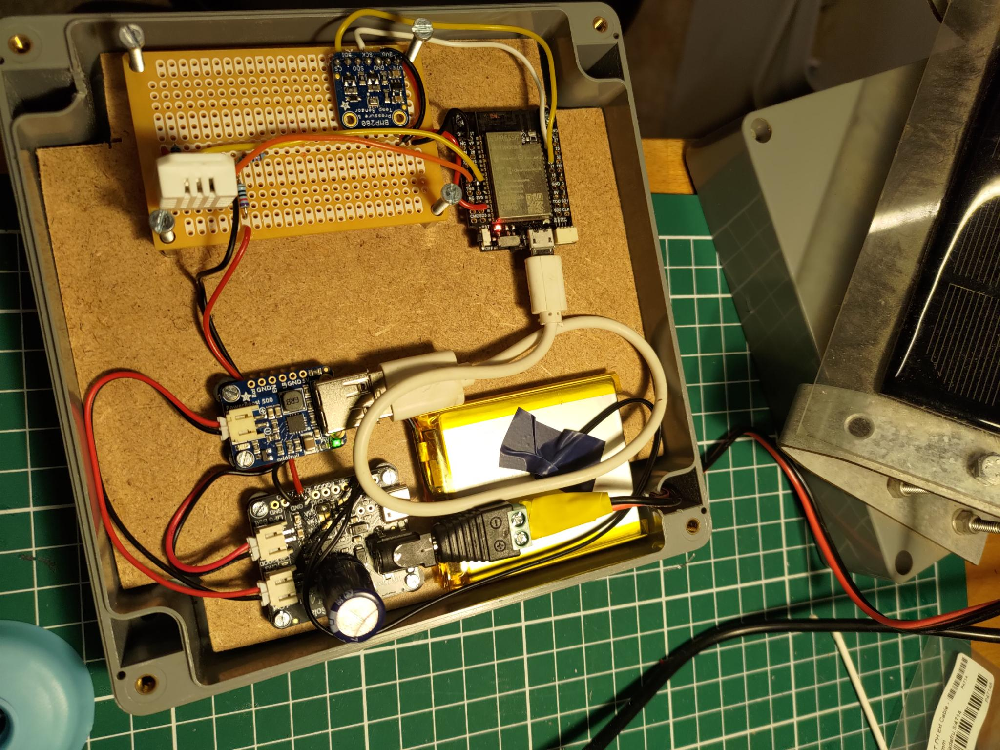
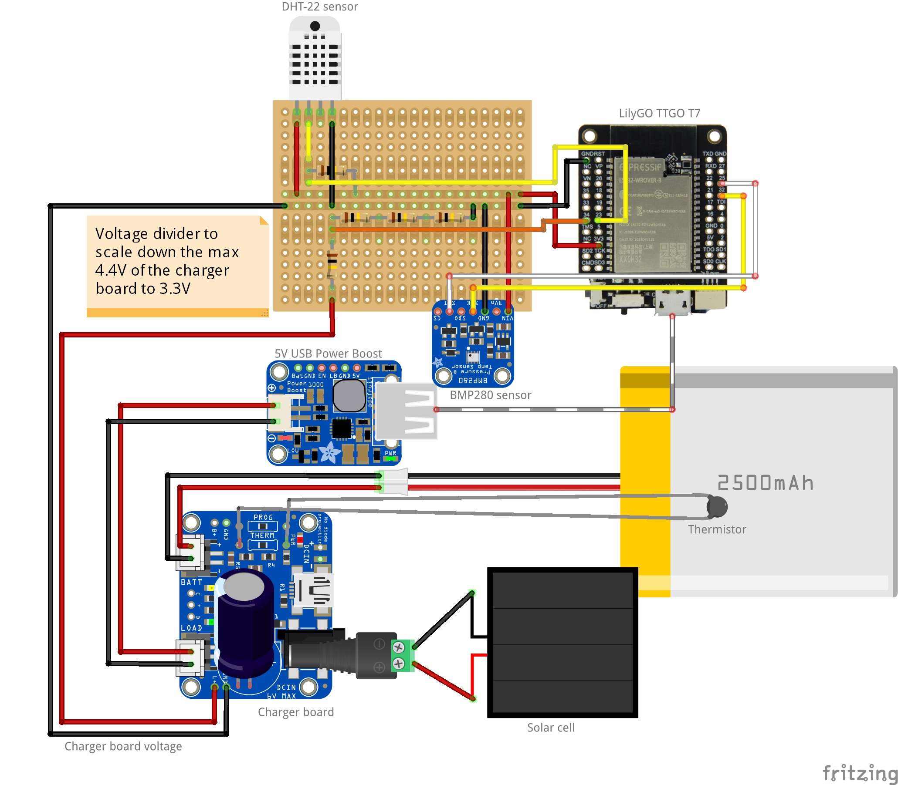

Weerstation Bram
===============

Contents
----------------------

1. [ Introduction ](#intro)
2. [ Used components ](#components)
3. [ Diagram ](#diagram)
4. [ Code ](#code)
5. [_Dashboard_](#dashboard)

## 1. Introduction

This repository provides an overview of a weather station build which is currently ongoing. The weather station is already reporting to a dashboard at https://weerstationbram.nl, but it still needs further upgrades. Upcoming changes:

- Adding a tipping bucket by adding the radio transceiver chip
- More stable reading of the voltage divider by changing the resistors

Future updates:

- Sensor hut for the temperature, humidity, and air pressure sensor

## 2. Used components

- Main microcontroller – [LilyGO TTGO T7 Mini32 V1.4 ESP32-WROVER](https://github.com/LilyGO/TTGO-T7-Demo) €12.00
- Temperature and humidity sensor – [DHT-22 (AM2302)](https://www.adafruit.com/product/385) €10.00
- Barometric Pressure and Temperature Sensor – [BMP280](https://www.adafruit.com/product/4059) €10.00
- Tipping bucket from another weather station – [AURIOL weather station sensor](https://www.handleidi.ng/auriol/ian-365824/handleiding)
- [Lithium Ion Polymer Battery – 3.7V 2500mAh](https://www.adafruit.com/product/328) €14.95
- Solar LiPo battery charger board – [bq24074](https://www.adafruit.com/product/4755) €14.95
- Solar panel 6V 500mA 145x145mm – [AliExpress](https://www.aliexpress.com/item/32877897718.html) €5.50
- 5V 500mA USB Boost – [PowerBoost 500 Basic](https://www.adafruit.com/product/1903) €9.95
- Thermistor to protect the battery during high and low temperatures – [10K Precision Epoxy Thermistor (3950 NTC)](https://www.adafruit.com/product/372) €4.00
- [2.1mm plug to screw terminal block](https://www.adafruit.com/product/369) €2.00
- [JST-PH 2-pin Jumper Cable](https://www.adafruit.com/product/1131) €2.00   
- 10k Ohm pull-up resistor for the DHT-22
- 4 × 100k Ohm resistors for a voltage divider to scale the charger board voltage down to 3.3V for GPIO

Other components:
- Perfboard
- Solid core wire (red, black, yellow), nuts, bolts, spacers
- USB cable: USB A to micro USB
- Heat shrink wrap, hot glue, soldering equipment

Components for the enclosure:
- Weatherproof box
- Piece of acrylic sheet
- 2 mounting hooks
- More nuts and bolts

## 3. Diagram

- The diagram shows an older charger board. The new version (see link above) handles the power out pin differently. This old version can give 6V from OUT, for which a buck boost converter is nescessairy. The new version I have installed will only go to 4.4, so only a boost converter is then sufficient.
- 10k Ohm pullup resistor for the data signal of the DHT-22 is adviced by the adafruit instructions
- Voltage divider to be able to read voltages from the charger board.

## 4. Code

The code is built and uploaded to the microcontroller using the PlatformIO extension in VSCode. See `Weerstation Bram/src/main.cpp` for the code running on the microcontroller.

## 5. Dashboard
The hosting solution consist of a (very) cheap linux ubuntu 22 server with the domain name weerstationbram.nl and www.weerstationbram.nl . With Lets Encrypt and Certbot it was pretty easy to get a (free) SSL certificate.
The backend to which the weather station reports consist of a mariaDB, Flask with Gunicorn is handling the API to the database. Nginx and grafana-server are layered on top of this.
Server costs for all this are currently around €2.80 per month

